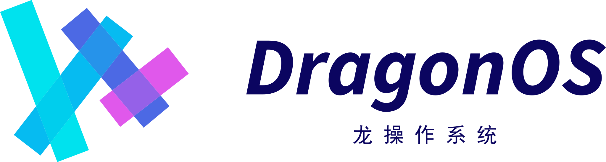

   
  <h2>DragonOS Community</h2>

---

欢迎来到DragonOS社区！

本文是加入并参与DragonOS社区贡献的起点，包括改进文档、改进代码或是参与社区会议等等...

如果您想了解更多关于项目结构以及DragonOS社区的内容，请转到[社区治理]以获取更多的信息！

**本文档的在线版本：** [community.dragonos.org](https://community.dragonos.org)

## 交流讨论

[社区交流]页面列出了DragonOS社区的公开交流渠道，如论坛、QQ群、会议等等。

对于更加具体的主题的讨论，请在SIG内进行。

## 社区治理

DragonOS社区官方支持以下类型的团体：

- **委员会** 是一组负责处理敏感话题的人员。社区官方鼓励该小组在能完成其使命的同时，尽可能开放其信息。
  但由于所讨论的主题的性质，这些讨论可能会在封闭的群组中进行。委员会的包括社区管理委员会(CMC)、
  项目管理委员会(PMC)、法务与合规委员会(LCC)等委员会。
- **特别兴趣小组(SIG)** 是专注于项目的一部分的持续开放团体。特别兴趣小组的程序必须公开透明。
  欢迎任何人参与并做出贡献，只要他们遵守 DragonOS 社区行为准则。
  SIG 的目的是拥有并开发一组**子项目**。
   * **子项目** 每个 SIG 可以有一组子项目。
    这些是可以独立工作的较小团体。
* **工作组**是为了解决跨 SIG 边界的问题而成立的临时小组。
  工作组不拥有任何代码或其他长期工件。
  工作组可以通过相关的 SIG 进行汇报并采取行动。

有关这些组的更多详细信息，请参阅[完整治理文档](governance/README.md)。 

## 参与贡献

要参与贡献，第一步是从[DragonOS社区SIG列表](sigs/README.md)中选择一个感兴趣的SIG。参与他们的会议，
加入他们在bbs上的板块。每个SIG通常都会有一些正在进行的，或者等待开发/解决的问题，可以帮助新的贡献者参与其中。

[贡献者指南]介绍了如何让您的想法和bugfix能被看到及接受的详细说明，在参与贡献之前，您应该先阅读它。

## 社区成员资格

我们鼓励所有贡献者成为社区成员。我们的目标是发展一个由贡献者、审阅者和代码维护者组成的活跃、健康的社区。在我们的[社区成员资格]页面中了解有关会员资格要求和责任的更多信息。

[社区治理]: governance/README.md
[社区交流]: communication/README.md
[贡献者指南]: contributors/README.md
[社区成员资格]: governance/community-membership.md
