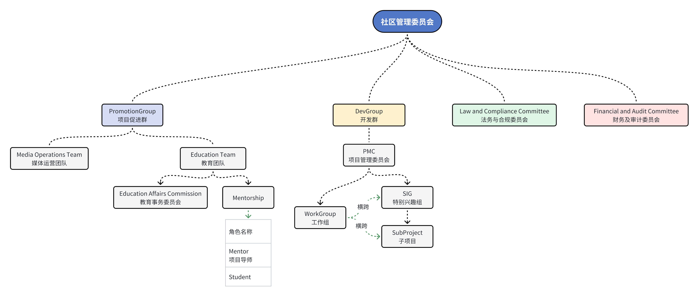

# 社区治理

## 原则

DragonOS社区遵循以下原则：

- 开源、开放：DragonOS社区坚持开源，并面向所有参与者开放。在公开场合进行协作。
- 社区驱动：DragonOS社区坚持社区驱动开发。
- 博采众长：根据技术的优势，以及项目的目标、范围、设计原则的一致性来接受各方的想法以及贡献。

## 行为准则

我们非常重视社区的良好环境，我们希望能够为DragonOS社区的贡献者和用户营造一个友好、积极的协作环境。
为了让大家获得的良好的参与体验，各方均需遵守[DragonOS社区行为准则](/contributors/code_of_conduct.md)。

## 社区组织架构

DragonOS社区由社区管理委员会、开发群、项目发展群，以及由社区管理委员会设立的，执行特殊职能的委员会组成。其中，
开发群和项目促进群面向公众开放，任何想要参与的人们，都能凭借自己的能力及付出，在其中找到自己的位置。社区管理委员会
及其下属的各职能委员会，由于其工作的敏感性（如涉及到私密数据等），由DragonOS社区邀请的合作伙伴（组织或个人）参与，
并不定期地向社区及公众披露信息。

## 开发群

开发群是DragonOS社区最重要的组织，由以下类型的子组组成：
- SIG（特别兴趣小组）
  - 子项目
- 工作组
- 项目管理委员会

关于开发群的进一步介绍，请转到[开发群文档](./dev-group.md)

## 委员会

某些主题（例如安全或行为准则）需要谨慎处理。 SIG 是公开运作的自愿团体，任何人都可以加入，而委员会则没有开放的成员资格，并且并不总是公开运作。
社区管理委员会可以根据需要组建特定职能的委员会，任期有限制或无限制。委员会的成员由社区管理委员会决定，但所有委员会成员必须是社区成员。
与 SIG 一样，委员会也有章程和主席，并将定期向社区管理委员会报告，并根据章程向社区报告。

## 社区管理层人员信息

请见[社区管理层人员信息](./staff-info.md)
